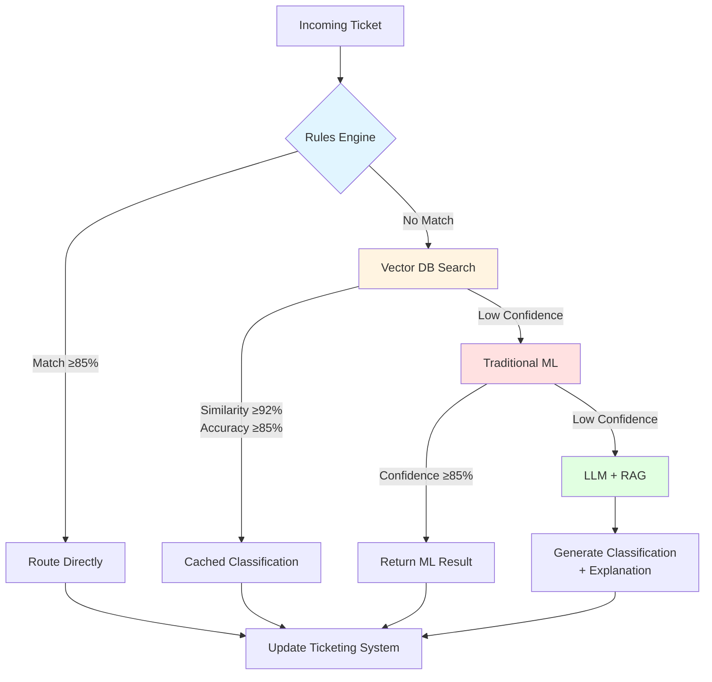
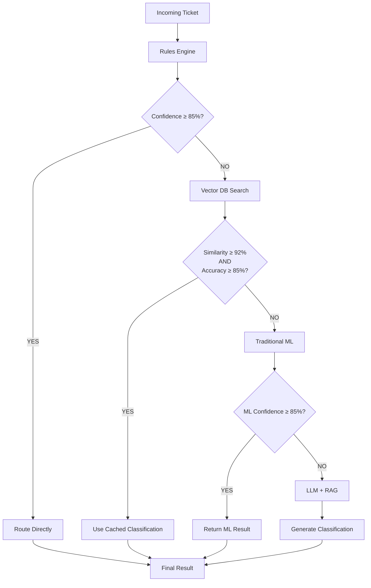
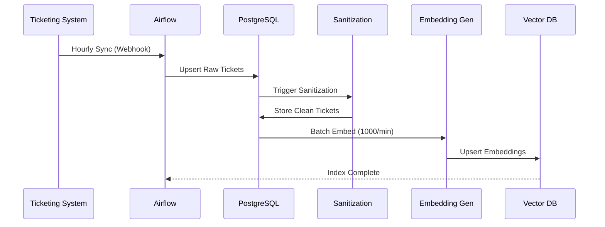
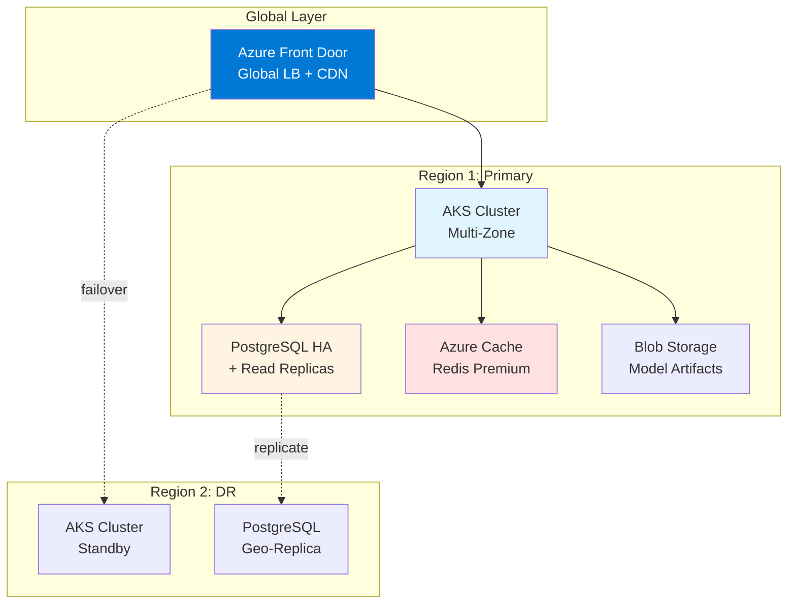
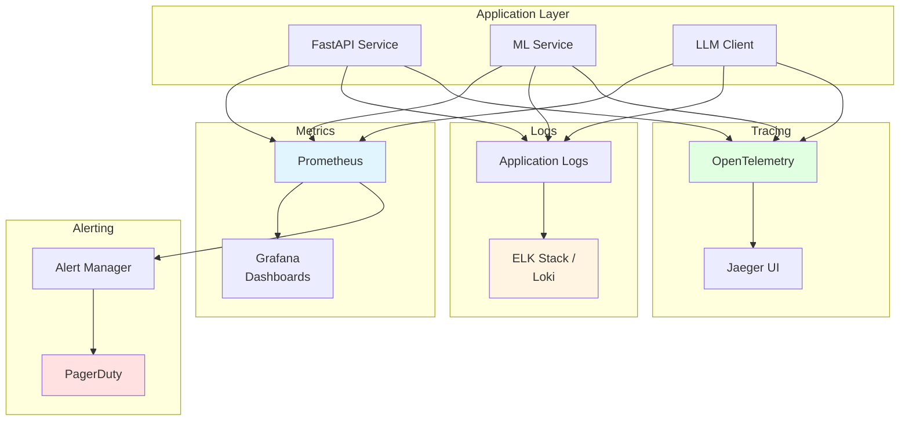

# Call Centre Agent — Production Roadmap

## Vision

Transform the current hybrid ML+LLM demo into a production-grade, cost-optimized, enterprise-ready ticket classification and routing system that:
- Minimizes LLM API costs through intelligent caching and vector similarity search
- Delivers sub-second response times for 95% of tickets
- Maintains audit trails and explainability for compliance
- Scales horizontally to handle 10,000+ tickets/hour
- Integrates seamlessly with existing ticketing systems (ServiceNow, Zendesk, Jira Service Desk)

## System Architecture Overview



## Strategic Pillars

### 1. Cost Optimization via Vector DB + RAG (Q1 2026)

**Goal**: Reduce LLM API costs by 70-85% while maintaining or improving accuracy.

**Approach**:
- **Vector Database Integration**: Deploy Pinecone, Weaviate, or Qdrant to store embeddings of historical tickets and their classifications.
- **Semantic Search First**: For each incoming ticket, perform vector similarity search to find the top-k most similar historical tickets (k=5-10).
- **Confidence-Based Routing**:
  - If the top match has similarity ≥ 0.92 and historical accuracy ≥ 85%, use cached classification (no LLM call).
  - If top-3 matches agree and confidence ≥ 85%, use ensemble vote (no LLM call).
  - Otherwise, invoke LLM with retrieved examples as few-shot context (RAG pattern).
- **Continuous Learning**: Validated classifications feed back into the vector DB, improving coverage over time.

**Technical Stack**:
- LangChain for orchestration (chains, agents, memory)
- OpenAI `text-embedding-3-small` or `text-embedding-ada-002` for embeddings (cost: ~$0.0001/1K tokens)
- Pinecone or Weaviate for vector storage (serverless tier sufficient for pilot)
- Redis for session caching and rate limiting

**Success Metrics**:
- LLM API cost per ticket: $0.002 → $0.0003 (85% reduction)
- P95 latency: <500ms (vs. current 2-3s for LLM calls)
- Cache hit rate: 60-75% within 3 months of deployment

---

### 2. Rules Engine + Hybrid Routing (Q1 2026)

**Goal**: Implement deterministic routing for high-confidence scenarios, reserving LLM for ambiguous cases.

**Routing Decision Flow**:



**Architecture**:

```
Incoming Ticket
    ↓
┌──────────────────────────────────────┐
│  Rules Engine (Drools / Python)      │
│  • Keyword patterns (exact match)    │
│  • Regex-based urgency detection     │
│  • SLA breach detection              │
└──────────────┬───────────────────────┘
               ↓
    Confidence ≥ 85%? ────YES──→ Route directly (no ML/LLM)
               ↓ NO
┌──────────────────────────────────────┐
│  Vector DB Similarity Search          │
│  • Top-k retrieval (k=5)             │
│  • Check historical accuracy          │
└──────────────┬───────────────────────┘
               ↓
    Match confidence ≥ 85%? ────YES──→ Use cached classification
               ↓ NO
┌──────────────────────────────────────┐
│  Traditional ML (scikit-learn)        │
│  • Fast baseline prediction          │
└──────────────┬───────────────────────┘
               ↓
    ML confidence ≥ 85%? ────YES──→ Return ML result
               ↓ NO
┌──────────────────────────────────────┐
│  LLM (Gemini/GPT-4) + RAG            │
│  • Use top-k examples as context     │
│  • Generate explanation               │
└──────────────────────────────────────┘
```

**Rules Engine Examples**:
- "account locked" → Security (100% confidence)
- "cannot login" + "urgent" → Technical Support, High Urgency (95% confidence)
- "refund" + "billing" → Billing Department (90% confidence)

**Implementation**:
- Python-based rules engine (or Drools if Java stack exists)
- YAML-based rule definitions for easy updates by business analysts
- A/B testing framework to validate rule performance vs. ML/LLM

---

### 3. Full MLOps Pipeline (Q2 2026)

**Goal**: Automate model training, evaluation, deployment, and monitoring with CI/CD integration.

**MLOps Architecture**:

```mermaid
graph LR
    A[Ticketing System] -->|Airflow| B[Raw Tickets DB]
    B -->|Sanitize + Label| C[Clean Tickets DB]
    C -->|Weekly Retrain| D[MLflow Tracking]
    D -->|Promote if F1 > baseline| E[Model Registry]
    E -->|Deploy| F[FastAPI Serving]
    F -->|Scale| G[Kubernetes HPA]
    G -->|Monitor| H[Prometheus + Grafana]
    H -->|Alert| I[PagerDuty]
    
    style D fill:#e1f5ff
    style E fill:#fff4e1
    style F fill:#e1ffe1
    style H fill:#ffe1e1
```



**Components**:

#### 3.1 Data Pipeline (Airflow / Prefect)
- **Ingestion**: Pull tickets from ServiceNow/Zendesk API hourly.
- **Sanitization**: Remove PII (regex + spaCy NER), anonymize customer IDs, normalize text (lowercasing, punctuation).
- **Labeling**: Store human-validated labels in PostgreSQL + append to training set.
- **Embedding Generation**: Batch-generate embeddings nightly and upsert to vector DB.

#### 3.2 Model Training (MLflow + Kubeflow)
- **Experiment Tracking**: MLflow for hyperparameter logs, metrics (F1, precision, recall), and model artifacts.
- **Scheduled Retraining**: Weekly retraining on last 90 days of data.
- **Model Registry**: Promote models to staging/production based on holdout F1 score (threshold: 0.88+).
- **A/B Testing**: Shadow mode for new models (log predictions without routing) before full deployment.

#### 3.3 Model Serving (FastAPI + KServe)
- **REST API**: FastAPI endpoints for `/classify`, `/batch-classify`, `/explain`.
- **Model Versioning**: Serve multiple model versions simultaneously (canary deployments).
- **Auto-scaling**: Kubernetes HPA based on request rate and p99 latency.

#### 3.4 Monitoring & Observability
- **Metrics**: Prometheus for API latency, throughput, error rates, LLM token usage.
- **Logs**: Structured JSON logs to ELK stack (Elasticsearch, Logstash, Kibana) or Loki.
- **Alerts**: PagerDuty/Opsgenie for:
  - Model accuracy drop >5% (drift detection)
  - p95 latency >2s
  - LLM API error rate >1%
- **Dashboards**: Grafana for real-time model performance, cost tracking, and SLA compliance.

---

### 4. Data Engineering & Vector DB Population (Q2 2026)

**Goal**: Build scalable data pipelines for historical ticket ingestion, embedding generation, and vector DB indexing.

**Data Pipeline Architecture**:



**Architecture**:

```
Ticketing System (ServiceNow/Zendesk)
    ↓ (Airflow DAG: hourly sync)
PostgreSQL (Raw Tickets)
    ↓ (Sanitization, PII removal)
PostgreSQL (Clean Tickets)
    ↓ (Embedding generation: batch 1000/min)
Vector DB (Pinecone/Weaviate)
    ↓ (Query: <50ms p95)
Classification Service
```

**Implementation Details**:
- **Batch Embedding**: Use OpenAI batch API (50% cheaper) for offline embedding generation.
- **Incremental Indexing**: Only embed new/updated tickets daily.
- **Deduplication**: Use MinHash or SimHash to detect duplicate tickets before embedding.
- **Metadata Filtering**: Store department, urgency, sentiment as metadata for hybrid search (vector + filter).

**Vector DB Schema** (Pinecone example):
```json
{
  "id": "ticket-12345",
  "values": [0.123, -0.456, ...],  // 1536-dim embedding
  "metadata": {
    "department": "Billing",
    "urgency": "High",
    "sentiment": "Negative",
    "resolved": true,
    "timestamp": "2026-01-15T10:30:00Z"
  }
}
```

---

### 5. Integration with Existing Ticketing Systems (Q3 2026)

**Goal**: Seamless bi-directional integration with enterprise ticketing platforms.

**Integrations**:

#### ServiceNow
- **Inbound**: REST API webhook on ticket creation → classify → update `assignment_group` and `urgency` fields.
- **Outbound**: Store classification reasoning in `work_notes` for agent visibility.
- **Authentication**: OAuth 2.0 service account with least-privilege access.

#### Zendesk
- **Inbound**: Zendesk webhook → classify → set ticket tags and priority.
- **Outbound**: Post classification as internal comment.

#### Jira Service Desk
- **Inbound**: Jira webhook → classify → assign to team and set SLA.
- **Outbound**: Add classification label and AI reasoning as attachment.

**Common Challenges**:
- **Rate Limits**: Implement exponential backoff and request batching.
- **Field Mapping**: Create abstraction layer to normalize across platforms.
- **Retry Logic**: Idempotent classification (cache by ticket ID) to handle retries safely.

---

### 6. Cloud Strategy & Infrastructure (Q3 2026)

**Goal**: Deploy on Azure (preferred) or AWS with multi-region availability and disaster recovery.

**Azure Cloud Architecture**:



**Azure Architecture** (Recommended):
```
┌─────────────────────────────────────────────────────────────┐
│  Azure Front Door (Global Load Balancer)                     │
└────────────────────┬────────────────────────────────────────┘
                     ↓
┌─────────────────────────────────────────────────────────────┐
│  Azure Kubernetes Service (AKS) — Multi-Zone                 │
│  • FastAPI Pods (HPA: 3-20 replicas)                        │
│  • Ingress: NGINX or Azure Application Gateway              │
└────────────────────┬────────────────────────────────────────┘
                     ↓
┌─────────────────────────────────────────────────────────────┐
│  Azure Services                                              │
│  • PostgreSQL Flexible Server (HA + read replicas)          │
│  • Azure Cache for Redis (Premium tier)                     │
│  • Azure Blob Storage (model artifacts, logs)               │
│  • Azure OpenAI Service (GPT-4, embeddings)                 │
│  • Azure Monitor + Log Analytics                            │
└─────────────────────────────────────────────────────────────┘
```

**AWS Alternative**:
- EKS (Elastic Kubernetes Service) instead of AKS
- RDS PostgreSQL + ElastiCache Redis
- S3 for storage
- Bedrock (Claude, Llama) or OpenAI via API Gateway

**Cost Optimization**:
- Use Azure Reserved Instances for AKS nodes (30-50% savings).
- Leverage spot instances for non-critical batch jobs.
- Enable auto-scaling and scale-to-zero for dev/test environments.

---

### 7. Governance, Auditing & Compliance (Q4 2026)

**Goal**: Meet enterprise security, privacy, and audit requirements for financial services / telco.

**Governance Framework**:

#### 7.1 Data Privacy (GDPR, POPIA, CCPA)
- **PII Handling**: Automatic detection and redaction of emails, phone numbers, account IDs.
- **Data Retention**: Purge raw tickets after 90 days; retain anonymized embeddings for 2 years.
- **Right to Deletion**: API endpoint to remove customer data from vector DB and logs.

#### 7.2 Model Governance
- **Model Cards**: Document training data, performance metrics, known biases, intended use.
- **Approval Workflow**: Require sign-off from Data Science Lead + Security before production deployment.
- **Version Control**: Git-based model versioning with semantic versioning (v1.2.3).

#### 7.3 Audit Trail
- **Classification Logs**: Store every classification decision with:
  - Input ticket (anonymized)
  - Model version
  - Prediction + confidence
  - Routing decision (rule/cache/ML/LLM)
  - Timestamp + user ID
- **Retention**: 7 years in append-only audit log (Azure Table Storage or AWS DynamoDB).
- **Compliance Reports**: Monthly accuracy audits, bias checks (department distribution), cost reports.

#### 7.4 Security
- **API Authentication**: OAuth 2.0 + JWT tokens with 1-hour expiry.
- **Secrets Management**: Azure Key Vault or AWS Secrets Manager for API keys.
- **Network Security**: Private endpoints for PostgreSQL/Redis; no public IPs.
- **Pen Testing**: Annual third-party security audits.

---

### 8. Monitoring, Observability & SRE (Ongoing)

**Goal**: Achieve 99.9% uptime with proactive incident detection and automated remediation.

**Observability Stack Architecture**:



**Observability Stack**:

#### Metrics (Prometheus + Grafana)
- **Business Metrics**: Tickets classified/hour, department distribution, escalation rate.
- **Technical Metrics**: API latency (p50, p95, p99), error rate, LLM token usage, cache hit rate.
- **Cost Metrics**: Daily LLM spend, compute cost, storage cost.

#### Logging (ELK or Loki)
- **Structured Logs**: JSON format with correlation IDs for tracing.
- **Log Levels**: DEBUG (dev), INFO (staging), WARN/ERROR (prod).
- **Sensitive Data**: Redact PII before logging.

#### Tracing (OpenTelemetry + Jaeger)
- **Distributed Tracing**: Trace requests across API → ML model → LLM → vector DB.
- **Latency Breakdown**: Identify bottlenecks (e.g., slow embedding generation).

#### Alerts (PagerDuty / Opsgenie)
- **P0 (Critical)**: Service down, error rate >5%, p95 latency >5s.
- **P1 (High)**: Model accuracy drop >10%, LLM rate limit hit, cache miss rate >50%.
- **P2 (Medium)**: Disk usage >80%, daily cost spike >20%.

#### Chaos Engineering
- **Failure Injection**: Simulate LLM API failures, vector DB outages, database slowdowns.
- **Resilience Validation**: Ensure fallback to ML-only mode works correctly.

---

## Roadmap Timeline

### Q1 2026: Cost Optimization & Smart Routing
- [ ] Integrate LangChain for orchestration
- [ ] Deploy vector DB (Pinecone pilot)
- [ ] Implement RAG-based LLM prompting
- [ ] Build rules engine with 10 high-confidence patterns
- [ ] Achieve 60% cache hit rate

### Q2 2026: MLOps & Data Engineering
- [ ] Set up Airflow data pipeline
- [ ] Implement MLflow experiment tracking
- [ ] Automate weekly model retraining
- [ ] Deploy FastAPI model serving with KServe
- [ ] Build Grafana monitoring dashboards

### Q3 2026: Enterprise Integration & Cloud Deployment
- [ ] Integrate with ServiceNow (pilot department)
- [ ] Deploy to Azure AKS (production environment)
- [ ] Implement multi-region failover
- [ ] Conduct security audit and pen testing
- [ ] Onboard 3 additional departments

### Q4 2026: Governance & Scale
- [ ] Implement audit logging and compliance reports
- [ ] Achieve 99.9% uptime SLA
- [ ] Scale to 10,000 tickets/hour
- [ ] Expand to 10+ departments
- [ ] Publish model cards and bias reports

---

## Success Criteria (End of 2026)

| Metric | Current (Demo) | Target (Production) |
|--------|----------------|---------------------|
| LLM Cost per Ticket | $0.002-0.005 | $0.0003 |
| P95 Latency | 2-3s | <500ms |
| Classification Accuracy | 92% | 95% |
| Uptime | N/A | 99.9% |
| Tickets/Hour Capacity | <100 | 10,000+ |
| Cache Hit Rate | 0% | 70% |
| Manual Reroute Rate | Unknown | <5% |

---

## Risk Mitigation

| Risk | Mitigation |
|------|------------|
| Vector DB vendor lock-in | Abstract via LangChain; support multiple backends (Pinecone, Weaviate, Chroma) |
| LLM API deprecation (Gemini) | Multi-provider support (GPT-4, Claude, Llama via Bedrock) |
| Model drift over time | Automated drift detection + weekly retraining |
| PII leakage to LLM | Pre-processing sanitization + OpenAI zero-retention policy |
| Ticket volume spikes | Auto-scaling + backpressure queueing (Redis) |

---

## Next Steps

1. **Pilot Phase** (Q1 2026): Deploy vector DB + RAG for Billing department only (500 tickets/day).
2. **Measure & Iterate**: Track cost savings, accuracy, and latency for 4 weeks.
3. **Expand Gradually**: Roll out to Technical Support, then Sales, then all departments.
4. **Document Learnings**: Update this roadmap quarterly based on production data.

---

For tactical implementation details, see `BACKLOG.md`.
