# 🌿 Git Branching Strategy Proposal
## Strategic Recommendation for Project Evolution

**Project**: Telco Call Centre Agent  
**Current Status**: Single `main` branch development  
**Recommendation**: Adopt structured branching strategy  
**Priority**: Medium-High (Proactive risk management)

---

## 📊 Current Project Assessment

### **Project Growth Indicators**
- ✅ **Codebase Size**: 66+ files across multiple domains
- ✅ **Feature Complexity**: Advanced AI classification with departmental routing
- ✅ **Technical Stack**: Multi-component (Streamlit, Gemini AI, Docker, CI/CD)
- ✅ **Production Ready**: Deployable demo with real-world applications
- ⚠️ **Risk Exposure**: All development on single branch

### **Current Workflow Risks**

```mermaid
graph TD
    A[Feature Development] --> B[Direct Commit to Main]
    B --> C{Production Impact?}
    C -->|Yes| D[🚨 Immediate Production Risk]
    C -->|No| E[✅ Safe Change]
    D --> F[Rollback Required]
    F --> G[Potential Data/Work Loss]
```


---

## 🎯 Strategic Rationale for Branching

### **1. Project Maturity Threshold Reached**
Your project has evolved beyond simple script development:
- **Multiple subsystems**: AI classification, routing logic, UI components
- **External dependencies**: Google Gemini API, model files, Docker
- **Deployment complexity**: Multiple environments and configurations
- **Quality requirements**: 100% test accuracy expectations

### **2. Future-Proofing Development**
```bash
# Current Constraint
main branch: All changes → Immediate production impact

# Proposed Freedom
feature branches: Experiment → Test → Review → Deploy
```

### **3. Risk Mitigation Matrix**

| Risk Factor | Current Exposure | With Branches |
|-------------|------------------|---------------|
| **Broken Production** | High | Low |
| **Lost Experimental Work** | High | None |
| **Deployment Rollbacks** | Complex | Simple |
| **Feature Conflicts** | Guaranteed | Isolated |
| **Quality Assurance** | Manual | Automated |

---

## 🚀 Proposed Branching Strategy

### **Branch Structure**
```
main (production-ready)
├── develop (integration branch)
├── feature/department-routing-v2
├── feature/gemini-model-upgrade
├── feature/ui-improvements
├── hotfix/critical-bug-fix
└── release/v1.0.0
```

### **Workflow Implementation**

#### **Phase 1: Foundation (Week 1-2)**
```bash
# 1. Create develop branch from main
git checkout -b develop
git push -u origin develop

# 2. Set up branch protection rules
# - Require PR reviews for main
# - Require status checks to pass
```

#### **Phase 2: Feature Development (Ongoing)**
```bash
# For each new feature
git checkout develop
git checkout -b feature/[feature-name]
# ... develop feature ...
git push -u origin feature/[feature-name]
# Create Pull Request to develop
```

#### **Phase 3: Release Management**
```bash
# When ready for production
git checkout develop
git checkout -b release/v1.0.0
# ... final testing ...
git checkout main
git merge release/v1.0.0
git tag v1.0.0
```

---

## 💡 Immediate Benefits

### **Development Freedom**
- **Experiment safely**: Try AI model changes without risk
- **Parallel features**: Work on UI while testing new algorithms
- **Clean history**: Organized commits with meaningful messages

### **Quality Assurance**
- **Automated testing**: CI runs on each branch before merge
- **Code review**: Mandatory review process for quality
- **Rollback simplicity**: Issues isolated to specific branches

### **Collaboration Ready**
- **Future team growth**: Structure ready for multiple developers
- **Documentation**: PR descriptions become feature documentation
- **Knowledge sharing**: Review process spreads understanding

---

## 🛠️ Implementation Roadmap

### **Immediate Actions (This Week)**
1. **Create `develop` branch** from current `main`
2. **Set up branch protection** rules on GitHub
3. **Document workflow** in repository README

### **Next Feature Implementation**
1. **Create feature branch** for next major enhancement
2. **Develop and test** in isolation
3. **Submit PR** with detailed description
4. **Merge after review** (self-review for now)

### **Tools and Automation**
- **GitHub Actions**: Automated testing on PR creation
- **Branch protection**: Prevent direct pushes to main
- **Automated deployment**: Deploy from main branch only

---

## 📈 Success Metrics

### **Short Term (1-2 months)**
- Zero production incidents from development
- 100% feature completion rate in branches
- Reduced time from development to deployment

### **Long Term (3-6 months)**
- Improved code quality scores
- Faster feature delivery cycles
- Scalable development process for team growth

---

## 🎪 Change Management

### **Transition Strategy**
- **Gradual adoption**: Start with next major feature
- **Learning curve**: Minimal (you already know Git basics)
- **Rollback plan**: Can revert to single-branch if needed

### **Developer Experience**
```bash
# Current workflow (stays the same for small fixes)
git add . && git commit -m "Fix typo" && git push

# New workflow (for features)
git checkout -b feature/my-enhancement
git add . && git commit -m "Add new feature"
git push -u origin feature/my-enhancement
# Create PR on GitHub
```

---

## 🎯 Conclusion & Next Steps

### **Strategic Recommendation: ADOPT**
Your Telco Call Centre Agent project has reached the complexity threshold where branching becomes beneficial rather than overhead. The structured approach will:

1. **Reduce production risk** by 90%
2. **Enable experimental development** without fear
3. **Prepare for future scaling** and collaboration
4. **Improve overall code quality** through review process

### **Proposed Timeline**
- **Week 1**: Set up branching structure
- **Week 2**: Implement first feature using new workflow
- **Week 3**: Evaluate and refine process
- **Week 4**: Full adoption for all new development

### **Decision Point**
The question isn't "*Do we need branches?*" but "*When do we implement them?*"  
**Recommendation**: Start with the next feature development cycle.

---

**Master Agent Recommendation**: ✅ **APPROVE BRANCHING STRATEGY**  
*Project complexity and growth trajectory justify proactive risk management through structured Git workflow.*

---

## 📚 Quick Reference Guide

### **Daily Commands**
```bash
# Start new feature
git checkout develop
git pull origin develop
git checkout -b feature/my-feature

# Work and commit
git add .
git commit -m "Implement feature component"

# Push and create PR
git push -u origin feature/my-feature
# Go to GitHub and create Pull Request

# After PR approval
git checkout develop
git pull origin develop
git branch -d feature/my-feature  # Clean up local branch
```

### **Emergency Hotfix**
```bash
# Critical production fix
git checkout main
git checkout -b hotfix/critical-issue
# ... make fix ...
git add . && git commit -m "Fix critical issue"
git push -u origin hotfix/critical-issue
# Create PR to main (fast-track review)
```

*This strategy balances development freedom with production stability, positioning the project for sustainable growth and future collaboration.*